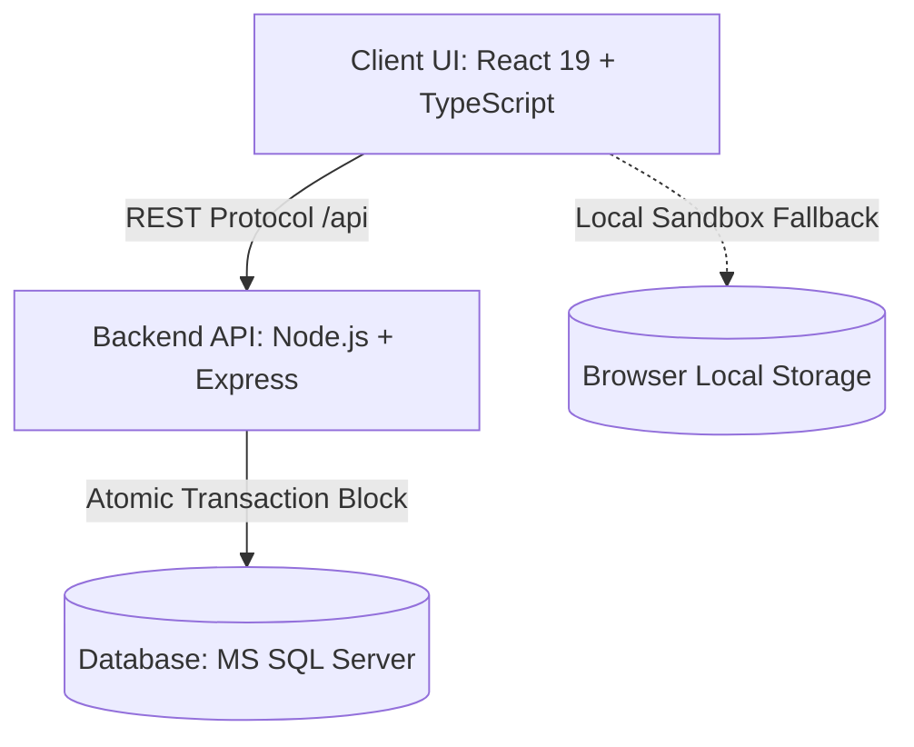

# 🎯 Portal OKR — Enterprise Governance, Analytics & Strategic Alignment Platform

> **Technical Case Study & Showcase**: Uma plataforma SaaS corporativa premium de alinhamento estratégico, projetada sob medida para substituir a infraestrutura do descontinuado Microsoft Viva Goals. Conecta metas executivas a entregas táticas com governança rígida, auditoria transacional e indicadores preditivos automáticos.

---

## 📖 The Vision (A Visão Estratégica)

O **Portal OKR** surgiu como uma iniciativa de **soberania digital e eficiência operacional**. Historicamente, a organização gerenciava suas metas estratégicas utilizando a plataforma corporativa **Microsoft Viva Goals**. Contudo, com o anúncio oficial de sua descontinuação pela Microsoft, a organização deparou-se com a necessidade de construir e implantar de forma ágil uma alternativa interna sob medida.

Em vez de depender de soluções de mercado engessadas, a decisão estratégica foi desenvolver um ecossistema independente alinhado às necessidades, fluxos e cultura da empresa:

*   **Autonomia Estratégica & Soberania Digital**: Total propriedade sobre os dados de performance organizacional, reduzindo a dependência de plataformas proprietárias terceiras.
*   **Flexibilidade Evolutiva**: Liberdade arquitetural para adaptar a plataforma continuamente de acordo com a maturação dos processos de governança da empresa.
*   **Impacto Cultural**: Desmistificação do processo de OKR. A plataforma transformou o acompanhamento de metas de uma burocracia administrativa em um cockpit vivo e integrado à rotina das equipes.
*   **Eficiência em Reuniões**: Com dados centrais auditados e atualizados em dashboards em tempo real, as reuniões executivas deixaram de focar no levantamento manual de dados e passaram a focar estritamente em tomadas de decisões e mitigações de riscos.

---

## ⚠️ The Problem (As Dores Corporativas)

Antes da implantação da plataforma, o alinhamento de metas enfrentava gargalos comuns a grandes corporações:

*   **Dispersão e Descentralização**: Informações táticas e financeiras distribuídas de forma caótica em planilhas paralelas e controles informais por e-mail.
*   **Baixa Rastreabilidade**: Falta de auditoria histórica estruturada sobre *quem* alterou o progresso de um indicador, *quando* alterou e *por que* a alteração foi realizada.
*   **Viés Humano (Falsos Positivos)**: Acompanhamentos subjetivos de metas baseados no "feeling" dos gestores, mascarando riscos e atrasos reais até que as metas chegassem ao prazo final.
*   **Falta de Rigor Financeiro**: Check-ins de metas críticas realizados sem comprovações documentais (orçamentos, propostas, contratos) anexados e auditados em fluxo único.

---

## 💡 The Solution (A Proposta da Plataforma)

O Portal OKR resolve estes problemas estruturando a gestão empresarial em três pilares fundamentais:

*   **RAG Preditivo Automático**: A saúde das metas é definida por um algoritmo temporal dinâmico, comparando a execução real com o tempo decorrido do ciclo, antecipando riscos de forma matemática e imparcial.
*   **Camada de Persistência Transacional**: Vínculo atômico entre check-ins, registros de progresso e uploads documentais Base64, impedindo a existência de registros órfãos ou inconsistências na base.
*   **Compliance de Auditoria Separada**: Desacoplamento de logs em bancos relacionais específicos, garantindo observabilidade para comitês de governança e auditoria de TI.

---

## ⚡ Core Features (Módulos Corporativos)

### 📊 1. Cockpit Executivo & Dashboards Estratégicos
Visualizações consolidadas estruturadas com a biblioteca **Recharts**, permitindo à diretoria analisar a evolução de OKRs organizacionais por departamento, classificar desvios e monitorar status consolidados de portfólio.

### 📐 2. Visualização de Árvore e Hierarquia
Mapeamento ramificado completo de cima para baixo. Conecta os macro-objetivos da empresa aos Key Results intermediários e às Iniciativas táticas operacionais, fornecendo clareza visual de alinhamento.

### ⚙️ 3. Check-ins Operacionais com Rastreabilidade
Interface tática de atualização onde o usuário altera o progresso do Key Result, insere observações obrigatórias e anexa propostas e orçamentos comerciais, gerando logs automáticos na central de auditorias.

### 💡 4. Mapeamento RAG Inteligente (Algoritmo de Saúde)
A saúde do projeto (Red, Amber, Green) é calculada de forma preditiva por um algoritmo que avalia o **GAP temporal**:

$$\text{Progresso Esperado} = \frac{\text{Tempo Decorrido}}{\text{Tempo Total do Ciclo}} \times 100$$
$$\text{Desvio (GAP)} = \text{Progresso Real} - \text{Progresso Esperado}$$

*   **🟢 Verde (No Prazo)**: $\text{Desvio} \ge -10\%$
*   **🟡 Amarelo (Atenção)**: $-25\% \le \text{Desvio} < -10\%$
*   **🔴 Vermelho (Em Risco)**: $\text{Desvio} < -25\%$

### 📋 5. Backlog de Evolução (Sugestões & Transparência)
Um canal de feedback integrado no formato Kanban. Os usuários solicitam melhorias operacionais, e o sistema registra e exibe o nome de **quem abriu o chamado** (`requesterName`). Caso a solicitação seja recusada, o sistema força a seleção de uma **justificativa estruturada** (ex: *inconsistência de regras de negócio*, *complexidade técnica inviável no momento*, *baixo impacto no ROI*), garantindo transparência no processo.

### 🎓 6. Trilhas de Treinamento
Seção com biblioteca de treinamentos integrada. Registra o progresso individual de visualização de vídeos por colaborador, gerando logs de treinamento na central do Administrador para garantir o aculturamento corporativo na metodologia OKR.

---

## 🏢 Enterprise Architecture

A plataforma foi projetada sob o princípio de separação de responsabilidades (SoC) e integridade de estado relacional:

### Stack Tecnológica & Decisões Arquiteturais
*   **Client State**: SPA construído em React 19 e TypeScript, empacotado sob Vite para alta velocidade de renderização. O roteador implementa tratativas de permissão e barreiras visuais baseadas em perfis.
*   **Persistência Relacional**: Escolha do Microsoft SQL Server para gerenciar as tabelas de metas, usuários e auditoria devido ao rigor transacional corporativo exigido.
*   **Camada API**: REST API em Node.js e Express. Configuração de limites de payload controlados e tratamento de exceções com rollback automático.

---

## 🛡️ Intelligent Governance (Segurança & Compliance)

*   **RBAC (Controle de Acesso Baseado em Funções)**: Isola e limita as visões entre **Tático** (vê apenas metas do seu departamento e realiza check-ins), **Estratégico** (visão geral, dashboards e relatórios consolidados) e **Administrador** (acesso completo a logs de acesso, auditoria e usuários).
*   **Simulação de Acesso ("Live Preview")**: Permite que o Administrador simule visualmente o acesso de qualquer colaborador ("ver como este usuário") para inspecionar permissões e validar a segurança das visualizações. Um banner amigável sinaliza a simulação e oferece o botão para encerrar a ação.
*   **Atomicidade de Transações**: Todas as ações críticas (ex: check-ins acoplados com uploads de propostas comerciais e geração de logs) ocorrem dentro de escopos `sql.Transaction` explícitos. Se qualquer componente do fluxo falhar, toda a operação sofre rollback.
*   **Higienização Sandbox**: Chaves do Microsoft Entra ID (Azure AD), e-mails reais e strings de banco foram totalmente desacoplados e higienizados nesta versão para disponibilização segura como case de portfólio.

---

## 🎨 UX & Visual Experience (Atmosfera Visual)

Inspirado em ferramentas SaaS de ponta como Stripe, Linear e Vercel, o Portal OKR combate a "fadiga de dados" por meio de um design limpo e moderno:

*   **Visual Escaneável**: Redução de ruído cognitivo. A interface foca no agrupamento lógico de informações, no contraste funcional e em espaçamentos equilibrados.
*   **Atmosfera Premium**: Paleta baseada em *dark mode* refinado com tons de grafite, preto fosco e azul profundo, iluminada por acentos em tons vibrantes de azul e laranja para direcionar o foco do usuário a dados críticos.
*   **Profundidade & Camadas**: Utilização de efeitos translúcidos e *glassmorphism* para criar divisões visuais naturais.
*   **Microinterações**: Animações de transição suaves (*fade-ins*, *skeleton loading* e feedbacks progressivos de botões) que trazem sensação de fluidez e qualidade na navegação diária.

---

## ⚙️ Technical Challenges (Desafios Técnicos Solucionados)

### 📁 1. Persistência de Propostas Comerciais e Documentos
*   **Desafio**: Integrar o upload e persistência de documentos comprobatórios (propostas financeiras em formato Base64) vinculados a check-ins de Key Results diretamente no SQL Server.
*   **Solução**: Implementação de tratamento estruturado de arquivos com validações de tamanho máximo de payload, tipos de arquivos e integridade de chave estrangeira. A operação ocorre sob transações explícitas no banco, garantindo que o documento seja gravado apenas se a atualização de progresso do OKR e o log de auditoria forem salvos simultaneamente.

### 🧮 2. Recalculação Recursiva de OKRs
*   **Desafio**: Manter o sincronismo em tempo real de OKRs hierárquicos aninhados. A alteração de progresso de uma Iniciativa tática deve atualizar a média aritmética do Key Result correspondente e, por consequência, o OKR pai, recalculando seus status RAG predictivos.
*   **Solução**: Estruturação de fluxos lógicos consistentes e tratativas aritméticas robustas compartilhadas no frontend e backend para evitar divergências e redundâncias de processamento de datas e valores limites.

---

## 📸 Screenshots & Showcase

> [!NOTE]
> Esta seção reserva espaço para a demonstração visual do produto rodando no repositório.

| Login Sandbox | Análise de OKRs |
| :---: | :---: |
|  |  |
| *Visualização de entrada por perfil* | *Análise de OKRs* |

| Lançamento com comprovantes Base64 | Governança de Acesso | Rastreabilidade de Alterações |
| :---: | :---: | :---: |
|  |  |  |
| *Lançamento com comprovantes Base64* | *Central de conformidade e auditoria completa* | *Central de conformidade e auditoria completa* |

---

## 🔮 Future Vision (Roadmap Técnico)

A evolução da plataforma foi projetada para adotar padrões arquiteturais e de infraestrutura de alta escalabilidade corporativa:

*   **Migração para NestJS**: Substituir o Express backend por NestJS para implementar uma arquitetura orientada a serviços altamente modular e baseada em injeção de dependências.
*   **Camada ORM (Prisma)**: Adoção do Prisma ORM para aprimorar a manutenção do banco de dados, garantir tipagem estrita de consultas e facilitar migrações de esquemas.
*   **Mensageria com Filas (RabbitMQ/BullMQ)**: Desacoplar operações pesadas (processamento de arquivos, compilação de logs em cascata e alertas automatizados de auditoria) em filas assíncronas assíncronas para maior tolerância a falhas.
*   **Observabilidade Centralizada**: Integração de ferramentas de logs estruturados e monitoramento de performance de requisições.

---

## 💡 Lessons Learned (Lições Aprendidas)

Como um profissional com trajetória inicial em **Operações de TI, Suporte e Infraestrutura**, o desenvolvimento do Portal OKR representou um marco de maturação e evolução profissional:

*   **IA como Acelerador de Engenharia**: Adotei a inteligência artificial como uma parceira estratégica para expandir minhas habilidades em desenvolvimento de software. Utilizei IA de forma ativa para depurar consultas complexas SQL, estruturar componentes visuais e planejar a arquitetura de simulações, consolidando a habilidade de decomposição de problemas complexos e validação contínua.
*   **Tradução de Contexto Corporativo**: Entendi que o papel do analista é traduzir as necessidades estratégicas informadas por gerentes e diretores em algoritmos precisos e utilizáveis, alinhando tecnologia e objetivos reais de negócios.
*   **Rigor Operacional**: A vivência prática com segurança de dados, controle de permissões (RBAC) e atomicidade transacional solidificou minha atenção à integridade estrutural do sistema em ambientes de produção corporativos.

---

## 👤 About the Author (Sobre o Autor)

**Filipe Macedo**
*IT Analyst | Infrastructure & Software Operations | BI, Analytics & Operations Specialist*

Minha evolução profissional de **Assistente para Analista de TI Júnior** foi impulsionada pela paixão por otimizar processos, automatizar fluxos e estruturar tomadas de decisão orientadas a dados. O Portal OKR é a consolidação dessa trajetória: uma prova prática de adaptabilidade técnica, pensamento sistêmico e capacidade de entrega de soluções reais.

Busco atuar em posições de **Assistente/Analista de Dados, BI Analyst, Analytics e Data/Software Operations**, aplicando minha sólida base em infraestrutura de TI e governança a ambientes de inteligência e governança de dados organizacionais.

*   [LinkedIn](https://www.linkedin.com/in/filipeariel/)
*   [GitHub](https://github.com/FilipeArielDM)
